# Leporello.js

Leporello.js is live coding IDE for pure functional subset of javascript. It provides novel debugging experience

## **[Try online](https://leporello-js.github.io/leporello-js/)**

## Features

- Mutating values is not allowed

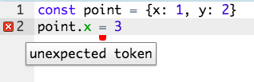

- All values are immutable. You create new values by applying change to old values

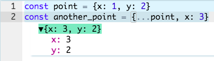

- Functional programs are trees of expressions that map values to other values,
  rather than a sequence of imperative statements which update the running
  state of the program. Because data is never mutated, you can jump to any
  point in execution of your program 

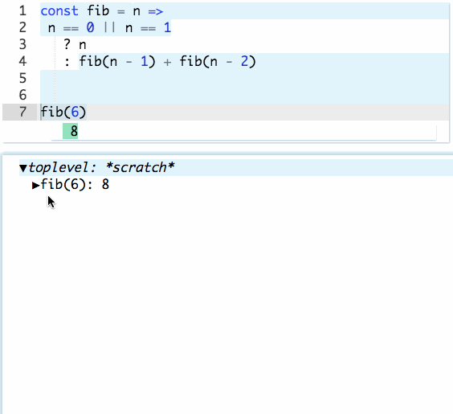

- and inspect any intermediate values

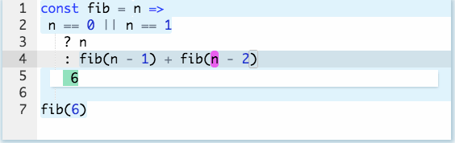

- Expressions that were evaluated have blue background. And that were not reached
have white background.

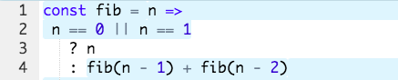

- Expressions that throw errors are red

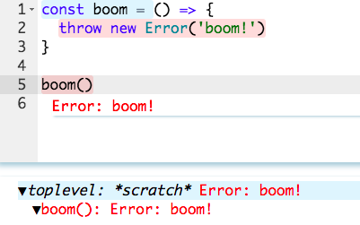

- When you put cursor inside function, the first call of this function is found

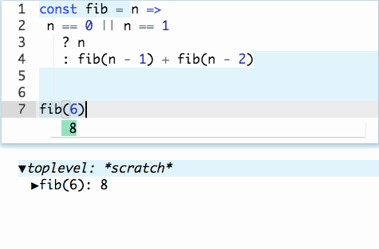

- You can edit this function and immediately see result

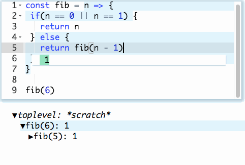

- Console logs are collected and displayed in a separate view. When you click
  the log you get into debugger to the call of `console.log` or
  `console.error`.  You can go back and forth like in a time machine.

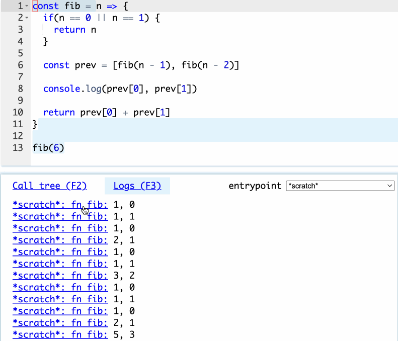

- Leporello is (mostly) self-hosted, i.e. built in itself

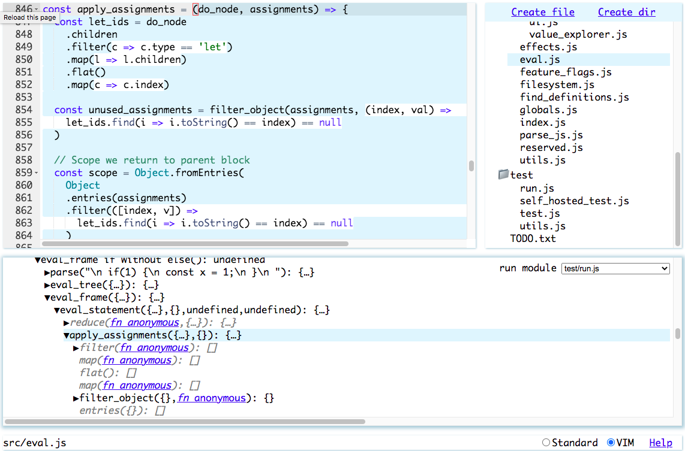


## Supported javascript subset

Variables are declared by `const` declaration. `var` is not supported. `let` variables can be declared to be assigned later, for cases when value depends on condition. Example:
```
let result
if (n == 0 || n == 1) {
  result = n
} else {
  result = fib(n - 1) + fib(n - 2)
}
```

Currenlty only one declaration for single `const` statement is supported (TODO).

Any kind of loops are not supported. Use recursion or array functions instead.

`if` / `else` can only contain blocks, not single statements (TODO).

Functions can be declared only by arrow function syntax. `function` keyword and method definitions (like `const foo = { bar() { /* body */ } }` may be supported in future. Both concise and block body are supported.

Classes are not supported. Some sort of immutable classes may be supported in future. `this` keyword is not currently supported. `new` operator is supported for instantiating builtin classes.

`switch` statements will be supported in future.

`try`, `catch` and `finally` will be supported in future. `throw` is currently supported.

ES6 modules are suppoted. Default exports are not currently supported, only named exports. Circular module dependencies are not supported (currently they crash IDE (TODO)). Import/export aliases are not supported. Exporting `let` variables is not supported. `import.meta` is not supported.

Async and await are supported.

Generators are not supported.

Destructuring is mostly supported.

Some operators are not currently supported:
  - Unary plus
  - Bitwise operators
  - `in`, `instanceof`
  - `void`
  - comma operator

Operators that are not supported by design (not pure functional):
  - increment, decrement
  - `delete`

## Importing third-party libs

Sometimes you want to import third party library that uses imperative language constructs. You may want to use it to perform side-effects or maybe it mutates data inside but still provides functional interface (does not mutate function arguments). Good example of such library is [bignumber.js](https://github.com/MikeMcl/bignumber.js/) - it makes a lot of mutating assignments inside, but `BigNumber` instances are immutable.

To use `bignumber.js` you add an `external pragma` before the import:

```
/* external */
import BigNumber from './path/to/bignumber.mjs';
```

`external pragma` is just a comment that contains only the literal string `external` (both styles for comments and extra whitespaces are allowed). Now the module is imported as a black box - you cannot debug `BigNumber` methods.

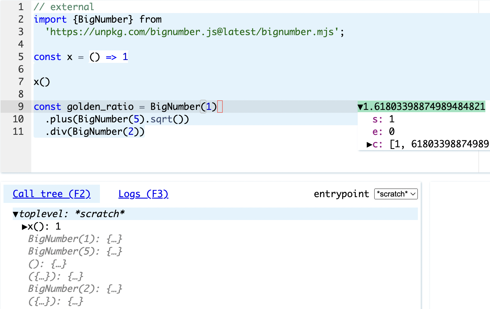

Currently every external is loaded once and cached until Leporello is restarted
(TODO change path to modules every time it changed on disk, since modules are
served from service workers).

<!---
## IO

To support livecoding experience, Leporello.js continuously run code while you
typing and navigating it. You don't even notice it while the code is pure, but
what about functions performing IO?

Leporello.js caches all IO calls when the code is run for the first time. Next
time, after you edit your code, functions that perform IO will not be called if
there is cached result.

Builtin IO functions are mocked to cache IO. Current list of builtin cached
functions is:
- `Math.random()`
- `fetch`

If you want to make your own own function IO-caching, or import third party
function and make it IO-caching, then you should use `IO` pragma.

// TODO document IO pragma
// TODO hotkey to bust cache

Caching algorithm is:

- Cached calls are expected to be in the same order, as in the non-cached
  execution. For example, if you first call `write` and then `read` and results
  are cached, and then you modify code to first call `read` and then `write`,
  then cache will be busted and Leporello will call non-cached `read` and
  `write`

- Arguments to IO-caching functions are expected to be deep equal to non-cached
  call, for cache to be used

- If there is a call that is not cached, then cache is busted and entire
  execution is restarted
-->

## Hotkeys

See built-in Help

## Editing local files

Editing local files is possible via [File System Access API](https://developer.mozilla.org/en-US/docs/Web/API/File_System_Access_API). Click "Allow access to local project folder" to grant access to local directory.

## Selecting entrypoint module

After you granted local filesystem access you can select which javascript file
to run. See the following picture

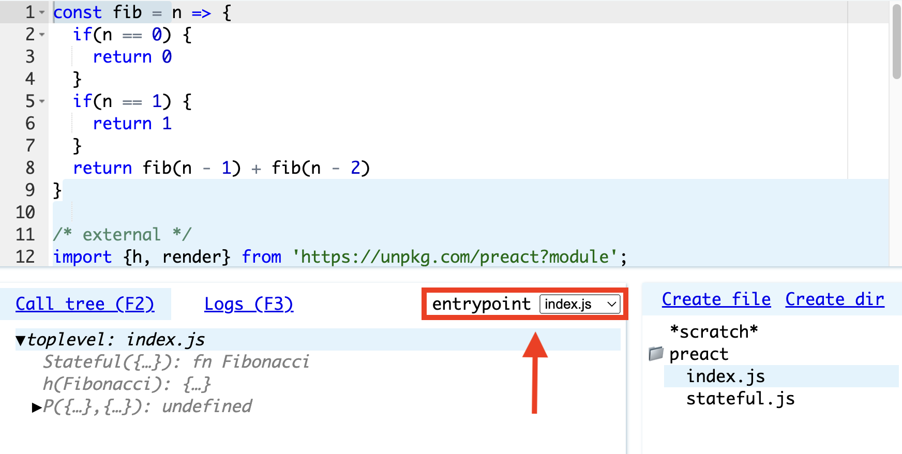

## Selecting html file

By default code in run in context of empty HTML file. If you want to use custom
HTML files with third party scripts or CSS stylesheets, you should choose HTML
file:

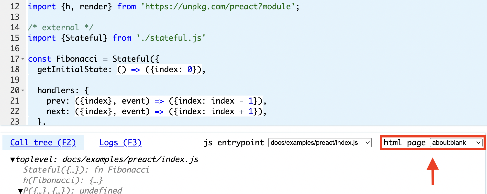

In typical HTML5 app you add to your html file a `script` element pointing to
your entry js module, like this:

```html
<script type='module' src='index.js'></script>
```

Because Leporello has built in bundler, you dont point to your entry module in
HTML file. Instead, you [select entrypoint module in
UI](#selecting-entrypoint-module).

If you want to use the same HTML file both for developing in Leporello.js and
in production, you can do it like this:

```html
<script type='module'>
  if(new URLSearchParams(window.location.search).get('leporello') == null) {
    import('./src/index.js');
  }
</script>
```

Leporello.js appends `?leporello` query parameter to your HTML file, so you can
test if HTML file is run in Leporello.js or in production.

## Run and debug UI code in separate window

By default your code is run in invisible iframe. If you want to run and debug
UI code then you can open separate browser window. Click "(Re)open run window"
in statusbar or press corresponding hotkey. New browser window will be opened
and your code will be run in that window.

While you interacting with your app in separate browser tab, all function calls
are recorded. You can inspect and debug them.

To try live example, grant file system access to
[./docs/examples/preact](./docs/examples/preact) folder. Then select `index.js`
as an entrypoint and click "(Re)open run window". You will see the app where
you can calculate Fibonacci numbers:


Try to click buttons and then get back to Leporello window. Now you can see
that all function calls have been recorded and you can inspect and debug
them:


You can even run and debug Leporello.js in Leporello.js! To do this:

- Check out Leporello.js repo and grant local filesystem access to root project directory
- Select `src/launch.js` as an entrypoint
- Select `index.html` as html file
- Click "(Re)open run window"

New instance of Leporello.js will be opened in new browser tab.

The only problem is that both instances of Leporello.js will share the same
localStorage. (TODO - inject localStorage implementation to opened window, that
allows to share localStorage between host Leporello.js instance and window
where code is run)


## Run Leporello locally
To run it locally, you need to clone repo to local folder and serve it via HTTPS protocol (HTTPS is required by [File System Access API](https://developer.mozilla.org/en-US/docs/Web/API/File_System_Access_API)). See [How to use HTTPS for local development](https://web.dev/how-to-use-local-https/)

## Running test suite
run tests in node.js:

```
node test/run.js
```

run tests in leporello itself:

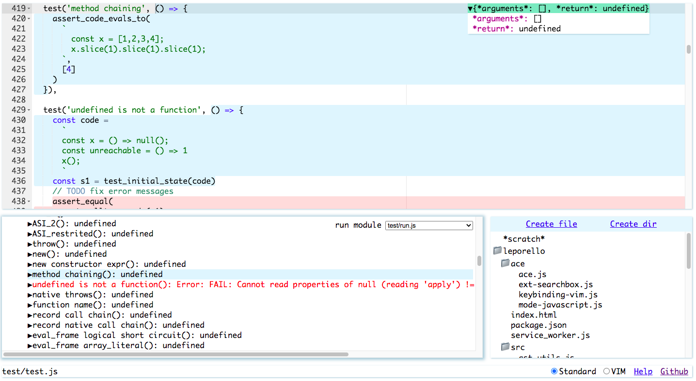

- grant local folder access
- select `test/run.js` as entrypoint


## Roadmap

* Use production level JS parser, probably typescript parser (so it will be
  possible to program in pure functional subset of typescript)
* Implement VSCode plugin
